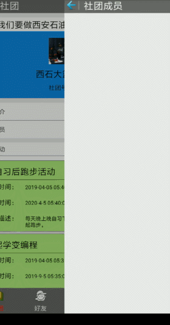
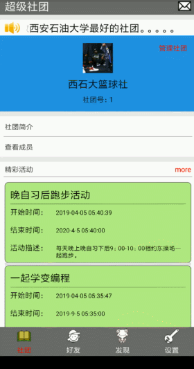
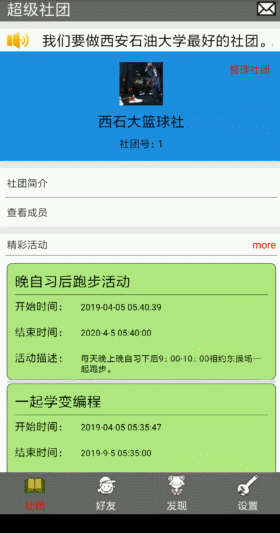
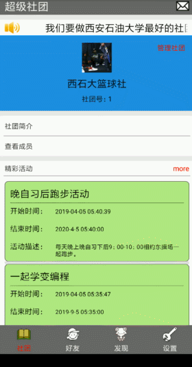

### 超级社团 ###
------------
本科毕业设计项目，分为移动Android端和服务器端。现在开源供大家交流与学习。本项目是移动Android端的代码，服务端代码请看[这里](https://github.com/KaiOrange/SuperAssociationServer)。

所使用的技术有：

* 原生Android开发技术
* gson
* xUtils
* ...

部署步骤：

1. 修改`SuperAssociation/src/com/xsy/superassociation/global/Global.java`文件下的后端地址;
3. 构建并启动项目。

>注：生产上不要使用硬编码将地址等信息写死到代码中。

部分功能演示：
1. 登录与退出（注：输入密码的时候黑屏是小米手机截屏的安全策略，不是软件问题）

2. 社团功能群发消息

3. 社团功能群发消息

4. 社团管理

5. 下课聊

6. 社团角

